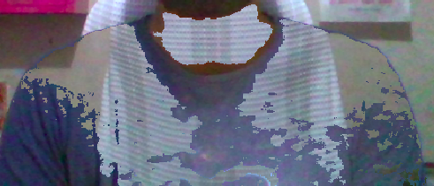

# Harry Potter Cloack
This is a cloack which is inspired from the movie Harry potter which can used to hide and merge into the background. 
When someone wers a blue color cloth and comes in front of the camera, the part covered with blue cloack will become invisible and the background behind that part can be seen. 
Things used:-
* OpenCV
* Numpy
* Python

Snap from the project:- 
